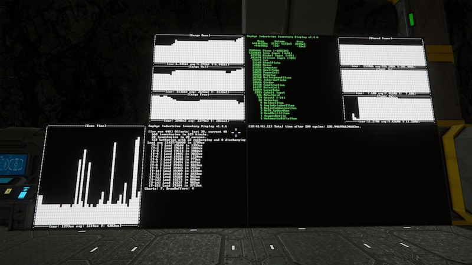
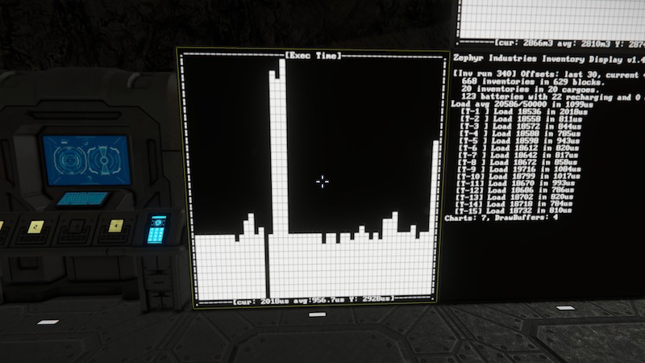
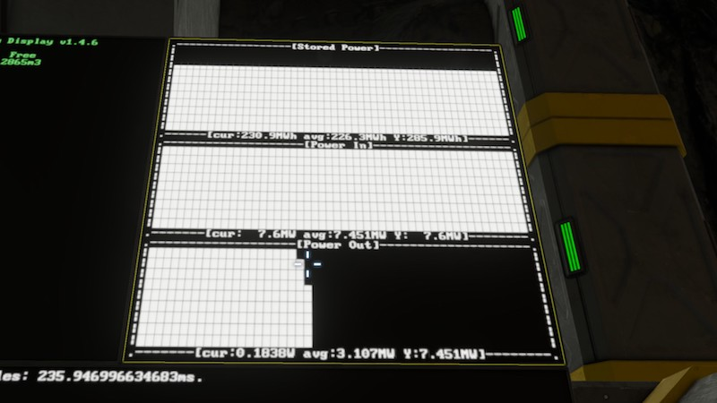
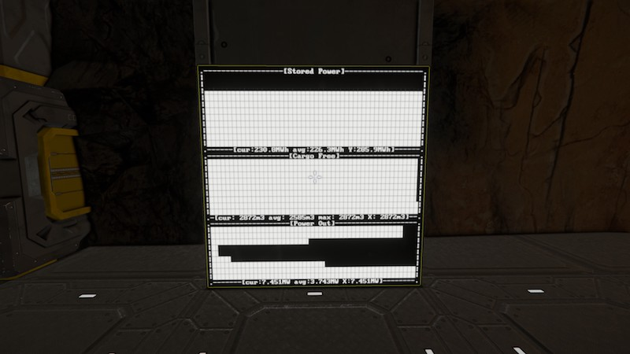

# space-engineers-zi-inventory-display
Space Engineers - Zephyr Industries Inventory Display



## Warning:

Zephyr Industries Inventory Display is functional but not particularly user-friendly at this stage. There isn't a great deal of documentation without looking at the source code for the script. If you're interested in learning how to write your own scripts, it's probably got some intermediate-level ideas in there for you to be inspired by.

## Living in the Future(tm)

*Ever wanted to see your entire bases's inventory at a glance? To see pretty charts of how your power demand has fluctuated over time?*

Zephyr Industries has what you need, I'm here to tell you about their great new product: _Zephyr Industries Inventory Display_.

Display sorted lists of your base inventory contents! Display bar charts of power supply, demand, and storage or of cargo capacity, usage, and free space. Display multiple charts on one LCD panel!

Life has never been so good, that's what Living in the Future(tm) means!

## Instructions:
* Place on a Programmable Block.
* The script will run automatically every 100 game updates, and scan for updates to your base every 300 game updates (~30-60 seconds).
* Mark LCD panels by adding a tag to their name and on the next base scan the script will start using it.
  * `@InventoryDisplay` is a sorted list of items and quantities and some basic stats.
  * `@DebugDisplay` displays info useful for script development, including performance.
  * `@WarningDisplay` displays any issues the script encountered.
  * `@ChartDisplay` will configure the display for charts. Configuration is a bit more complicated, see the *Chart Displays* section for more details.
* Make sure you have [Zephyr Industries Bar Charts set up too](https://github.com/illusori/space-engineers-zi-bar-charts#instructions) if you want bar charts.

## Notes:
* Yeah, Isy's Inventory Manager does most of this and far more. I suggest you go use that unless one of the features in this script really appeals to you. I wrote this as a learning exercise for myself (my first C# project) and to suit my personal needs rather than to be a replacement for a script that has been actively developed and supported for years.

## Chart Displays:

NOTE: Chart displays are handled by [Zephyr Industries Bar Charts](https://github.com/illusori/space-engineers-zi-bar-charts#instructions), so check out the instructions there if you want more details.

To configure a chart display you need tag the name with `@ChartDisplay` and to edit the Custom Data for the display.

The Custom Data follows an INI-file format with section names indicating what chart you'd like to display and section keys adding extra parameters to the chart.

Some examples are probably a bit easier to understand.

### Basic Execution Time Chart



Set the Custom Data to:

```
[Inv Exec Time]
```

This creates one chart tracking the `Inv Exec Time` series for script execution time, with the default options: fill the entire panel, have the bars aligned vertically and time horizontal.

### Triple Power Chart



```
[Stored Power]
height=13

[Power In]
y=13
height=11

[Power Out]
y=24
height=11
```

This places three charts onto one display folowing the `Stored Power`, `Power In` and `Power Out` series. It also overrides the default layout so that they tile one above the other taking up about a third of the height of the panel each and the full width.

### Mixing It All Together



```
[Stored Power]
height=13

[Cargo Free]
y=13
height=11
horizontal=false
show_cur=false
show_max=true

[Power Out]
y=24
height=11
horizontal=false
```

Creates three charts on one display:

* The top chart is stored power, similar to the triple chart.
* The middle chart is free cargo space, with bars going horizontally. The current value is hidden from the legend, and the max value is shown.
* The bottom chart is tracking power leaving the batteries and other than being horizontal is a standard chart.

### List of chart series

Series name | Description
--- | ---
Stored Power | How much power is stored in your batteries.
Power In | How much power is entering your batteries.
Power Out | How much power is leaving your batteries.
Cargo Mass | How much mass (tonnes) of cargo is within all cargo containers.
Cargo Vol | How much volume (m3) is used within all cargo containers.
Cargo Free | How much volume (m3) is free within all cargo containers.
O2 Vol | How much volume (m3) is used within all oxygen tanks.
O2 Free | How much volume (m3) is free within all oxygen tanks.
H2 Vol | How much volume (m3) is used within all hydrogen tanks.
H2 Free | How much volume (m3) is free within all hydrogen tanks.
Inv Exec Time | (debug) Microsecond timings of how long the script ran for on each invocation.
Inv Instr Load | (debug) Instruction count complexity load for each invocation of the script.

### List of chart options

Zephyr Industries Inventory Display makes use of Zephyr Industries Bar Charts, the documentation there on [supported options](https://github.com/illusori/space-engineers-zi-bar-charts#list-of-chart-options) is likely to be more complete and kept more up-to-date.

Option | Default | Description
:---: | :---: | :---
x | 0 | Panel column to start the chart at. 0 is leftmost column.
y | 0 | Panel line to start the chart at. 0 is topmost line.
width | panel width | Number of panel columns to span. 52 is max for 1x1 panel, 104 for 2x1.
height | panel height | Number of panel lines to span. 35 is max for both 1x1 and 2x1 panels.
name | no value | If set it will be used for the chart series instead of the section name.
horizontal | true | If false, the chart will run top to bottom rather than right to left.
show_title | true | Should the chart title be displayed in the top border?
show_cur | true | Should the current series value be displayed in the bottom border?
show_avg | true | Should the average value of the displayed bars be shown?
show_max | false | Should the max value of the displayed bars be shown?
show_scale | true | Should the scale (max Y point) be displayed in the bottom border?

The scale is automatically set by some heuristics that sorta make sense and seem to work for me.

There's currently no way to set the title to be something other than the name of the series.

Setting x/y/width/height values that are outside the bounds of the display will stop the script, you'll need to fix the values then recompile the script. As I said at the top, it isn't very user-friendly right now.

## Contributing:

Zephyr Industries Inventory Display is open source, under an MIT license. You can contribute to or copy the code at https://github.com/illusori/space-engineers-zi-inventory-display.
